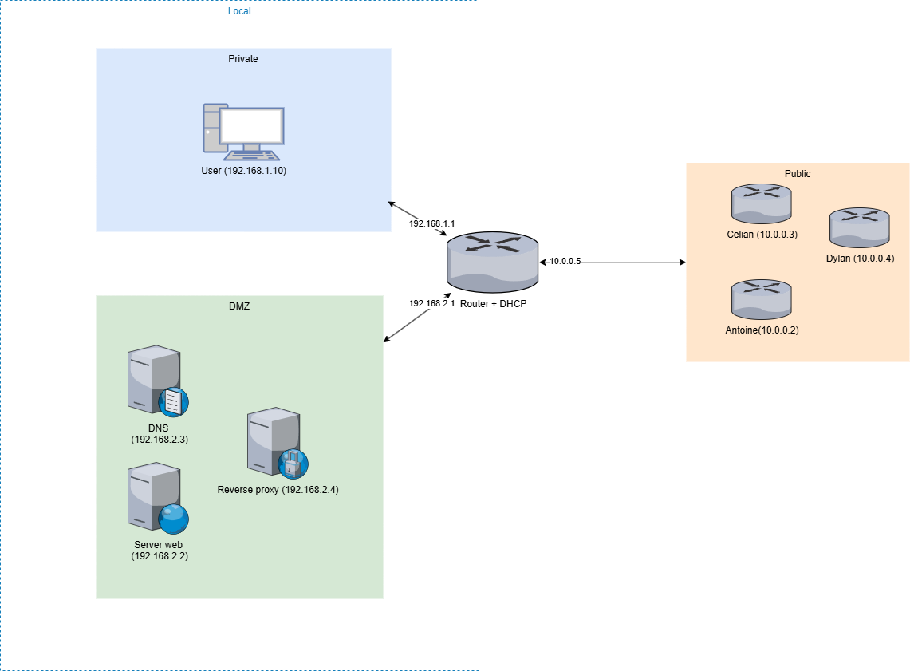
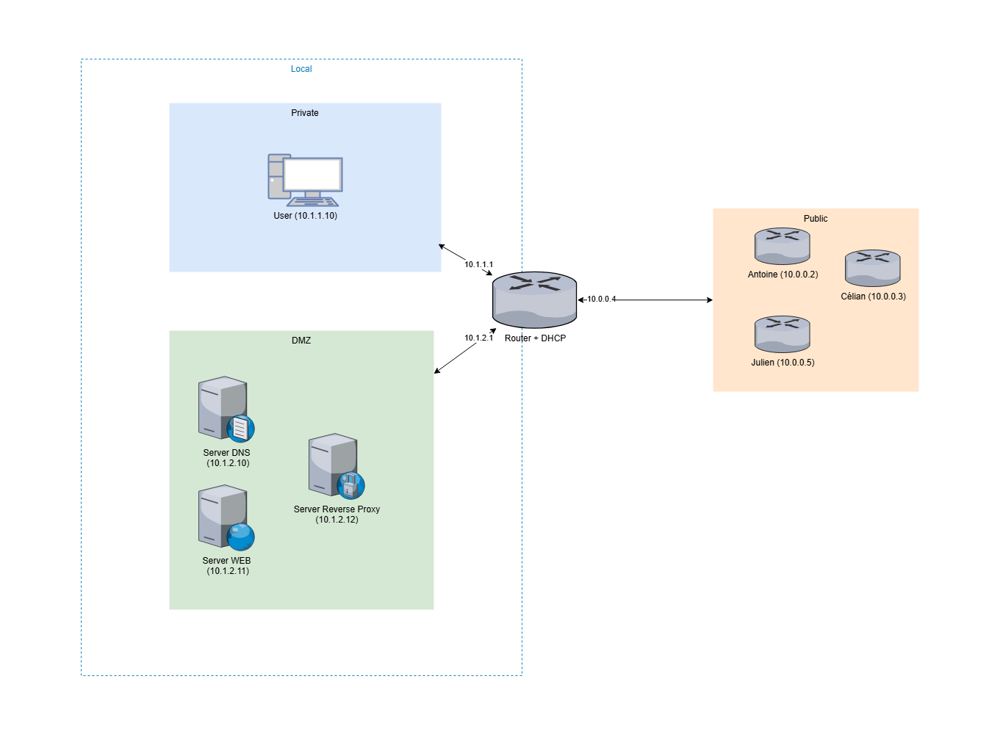

# Compte Rendu : Projet 1IR - Les Protocoles de l'Internet 2024-2025

## **Objectif du Projet**
Le projet vise à comprendre et maîtriser les principaux protocoles et mécanismes des réseaux Internet classiques à faible échelle, comme les réseaux domestiques ou d'entreprise. Les objectifs spécifiques sont :
- Concevoir un réseau d'entreprise en suivant une démarche incrémentale.
- Appliquer les concepts théoriques étudiés en cours à travers une mise en œuvre pratique.
- Développer des compétences en configuration réseau et en sécurité.

## **Organisation**

### **Travail individuel**
Chaque étudiant doit :
- Concevoir et mettre en place son propre réseau sur des machines virtuelles.
- Réaliser une architecture intégrant un réseau privé et une DMZ.

### **Travail en groupe**
Les membres d’un groupe (4 étudiants) collaborent pour :
- Interconnecter leurs réseaux respectifs.
- Tester l'intégration de leurs réseaux.
- Produire un rapport détaillé des choix techniques et des observations.

#### **Répartition des outils de virtualisation**
| **Membre**         | **Outil de virtualisation utilisé** |
|---------------------|-------------------------------------|
| **Julien Couderc**  | VirtualBox                         |
| **Dylan Latapie**   | VirtualBox                         |
| **Antoine Gouzy**   | Docker                             |
| **Célian Hache**    | Docker                             |

### **Livrables**
Le rapport de groupe devra inclure :
- **Obligatoire** :
  - Un **dessin de l'architecture réseau** individuelle pour chaque membre.
  - Une **représentation de l’interconnexion des réseaux** du groupe.
  - Les **choix techniques principaux** et leur justification.
- **Recommandé** :
  - Les **difficultés rencontrées** et les solutions apportées.
  - Les **points intéressants** du projet.
- **Annexe possible** (optionnel) :
  - Scripts ou fichiers de configuration.
  - Tuto ou documentation complémentaire.
  - Une approche créative, comme un "livre dont vous êtes le héros".

    
## **1. Segmentation réseau**

Pour garantir une sécurité et une organisation optimales, le réseau a été segmenté en trois parties principales :

### **Réseau privé**
Ce réseau est dédié aux machines internes de l’entreprise (postes utilisateurs, serveurs internes non accessibles de l'extérieur). Il permet une communication sécurisée entre les utilisateurs et les ressources internes, avec une protection contre les accès extérieurs non autorisés.

- **Rôle** : Sécuriser les données internes.
- **Configuration** : Adresses IP attribuées dynamiquement via un serveur DHCP.
- **Sécurité** : Règles de pare-feu pour empêcher les accès non autorisés venant de la DMZ ou de l'extérieur.

### **DMZ (Zone Démilitarisée)**
La DMZ héberge les services accessibles depuis l'extérieur, comme un site web, un serveur DNS, ou des applications spécifiques. Cela limite les risques de compromission des systèmes internes si un service public est attaqué.

- **Rôle** : Héberger des services publics sans exposer le réseau privé.
- **Configuration** : Adresses IP fixes pour les serveurs (DNS, web, NGINX).
- **Sécurité** : Pare-feu configuré pour limiter les connexions aux seuls ports nécessaires (HTTP, HTTPS, DNS).

### **Interconnexion routeur**
Cette partie connecte les différentes segments (réseau privé, DMZ) entre eux et avec l’extérieur. Elle joue un rôle crucial dans la gestion des flux réseau et le filtrage des paquets.

- **Rôle** : Centraliser le routage entre les segments et l'extérieur.
- **Configuration** : Routes statiques ou dynamiques en fonction des besoins.
- **Sécurité** : Règles NAT pour masquer les adresses internes.

## Section individuelle

### Julien Couderc

#### **1. Plages d'adresses**

Pour garantir une gestion simplifiée des adresses IP et éviter tout conflit, le réseau principal a été subdivisé en sous-réseaux.

| **Segment**             | **Sous-réseau**    | **Masque**      | **Plage d'adresses**   | **Utilisation**                                           |
|-------------------------|--------------------|-----------------|------------------------|-----------------------------------------------------------|
| Réseau privé            | 192.168.1.0/24       | 255.255.255.0   | 192.168.1.1 - 192.168.1.254  | Station de travail                 |
| DMZ                     | 192.168.2.0/24       | 255.255.255.0   | 192.168.2.1 - 192.168.2.254  | Hébergement de services publics.                         |
| Interconnexion routeur  | 10.0.0.0/24       | 255.255.255.0   | 10.0.0.1 - 10.0.0.254  | Interfaces des routeurs entre segments.                  |

Chaque sous-réseau est isolé des autres via des règles de pare-feu, limitant les communications aux seuls flux nécessaires.

#### **2. Détails d’adressage**

##### **Réseau privé**
- **Passerelle** : 192.168.1.1 (assurée par le routeur interne).
- **Adresses dynamiques (DHCP)** : Réservées pour les postes utilisateurs (192.168.1.10 à 192.168.1.210).
- **Configuration** : 
  - Serveur DHCP sur le routeur interne.
  - Attribution dynamique pour simplifier la gestion des postes utilisateurs.

##### **DMZ**
- **Passerelle** : 192.168.2.1.
- **Adresses fixes pour les serveurs** :
  - Serveur Web : 192.168.2.2.
  - Serveur DNS : 192.168.2.3.
  - Serveur NGINX : 192.168.2.4.
- **Configuration** : Adresses IP configurées manuellement pour garantir une disponibilité constante.

##### **Interconnexion routeur**
- **Interfaces des routeurs** :
  - Routeur interne (10.0.0.5) : Relie le réseau privé et la DMZ.
  - Routeur externe 1 (10.0.0.2), 2 (10.0.0.3), et 3 (10.0.0.4) : Relient le réseau interne au WAN.

#### **3. Architecture du réseau**

Nous avons choisi une architecture avec un routeur central interne faisant la liaison entre le réseau privé, la DMZ, et le réseau externe avec les routeurs de Célian, Antoine et Dylan.

Voici le schéma de l'architecture réseau que nous avons mis en place :



### Célian Hache

#### **1. Plages d'adresses**

Pour garantir une gestion simplifiée des adresses IP et éviter tout conflit, le réseau principal a été subdivisé en sous-réseaux.

| **Segment**             | **Sous-réseau**    | **Masque**      | **Plage d'adresses**   | **Utilisation**                                           |
|-------------------------|--------------------|-----------------|------------------------|-----------------------------------------------------------|
| Réseau privé            | 172.18.0.0/24       | 255.255.255.0   | 172.18.0.0 - 172.18.0.254  | Stations utilisateurs                 |
| DMZ                     | 172.18.1.0/24       | 255.255.255.0   | 172.18.1.0 - 172.18.0.1  | Hébergement de services publics.                         |
| Interconnexion routeur  | 10.0.0.0/24       | 255.255.255.0   | 10.0.0.1 - 10.0.0.254  | Interfaces des routeurs entre segments.                  |

Chaque sous-réseau est isolé des autres via des règles de pare-feu, limitant les communications aux seuls flux nécessaires.

#### **2. Détails d’adressage**

##### **Réseau privé**
- **Passerelle** : 172.18.0.2 (assurée par le routeur interne).
- **Adresses dynamiques (DHCP)** : Réservées pour les postes utilisateurs (172.18.0.101 à 172.18.0.200).
- **Configuration** : 
  - Serveur DHCP sur le routeur interne.
  - Attribution dynamique pour simplifier la gestion des postes utilisateurs.

##### **DMZ**
- **Passerelle** : 172.18.1.2.
- **Adresses fixes pour les serveurs** :
  - Serveur Web : 172.18.1.3.
  - Serveur DNS : 172.18.1.4.
  - Serveur NGINX : 172.18.1.5.
- **Configuration** : Adresses IP configurées manuellement pour garantir une disponibilité constante.

##### **Interconnexion routeur**
- **Interfaces des routeurs** :
  - Routeur interne (10.0.0.3) : Relie le réseau privé et la DMZ.
  - Routeur externe 1 (10.0.0.2), 2 (10.0.0.4), et 3 (10.0.0.5) : Relient le réseau interne au WAN.

#### **3. Architecture du réseau**

Nous avons choisi une architecture avec un routeur central interne faisant la liaison entre le réseau privé, la DMZ, et le réseau externe avec les routeurs de Julien, Antoine et Dylan.

Voici le schéma de l'architecture réseau que nous avons mis en place :


### Dylan Latapie

#### **1. Plages d'adresses**

Pour garantir une gestion simplifiée des adresses IP et éviter tout conflit, le réseau principal a été subdivisé en sous-réseaux.

| **Segment**             | **Sous-réseau**    | **Masque**      | **Plage d'adresses**   | **Utilisation**                                           |
|-------------------------|--------------------|-----------------|------------------------|-----------------------------------------------------------|
| Réseau privé            | 10.1.1.0/24       | 255.255.255.0   | 10.1.1.0 - 10.1.1.254  | Stations utilisateurs                 |
| DMZ                     | 10.1.2.0/24       | 255.255.255.0   | 10.1.2.0 - 10.1.2.254  | Hébergement de services publics.                         |
| Interconnexion routeur  | 10.0.0.0/24       | 255.255.255.0   | 10.0.0.1 - 10.0.0.254  | Interfaces des routeurs entre segments.                  |

Chaque sous-réseau est isolé des autres via des règles de pare-feu, limitant les communications aux seuls flux nécessaires.

#### **2. Détails d’adressage**

##### **Réseau privé**
- **Passerelle** : 10.1.1.1 (assurée par le routeur interne).
- **Adresses dynamiques (DHCP)** : Réservées pour les postes utilisateurs (10.1.1.10 à 10.1.1.254).
- **Configuration** : 
  - Serveur DHCP sur le routeur interne.
  - Attribution dynamique pour simplifier la gestion des postes utilisateurs.

##### **DMZ**
- **Passerelle** : 10.1.2.1.
- **Adresses fixes pour les serveurs** :
  - Serveur Web : 10.1.2.11.
  - Serveur DNS : 10.1.2.10.
  - Serveur NGINX : 10.1.2.12.
- **Configuration** : Adresses IP configurées manuellement pour garantir une disponibilité constante.

##### **Interconnexion routeur**
- **Interfaces des routeurs** :
  - Routeur interne (10.0.0.4) : Relie le réseau privé et la DMZ.
  - Routeur externe 1 (10.0.0.2), 2 (10.0.0.3), et 3 (10.0.0.5) : Relient le réseau interne au WAN.

#### **3. Architecture du réseau**

Nous avons choisi une architecture avec un routeur central interne faisant la liaison entre le réseau privé, la DMZ, et le réseau externe avec les routeurs de Célian, Antoine et Julien.

Voici le schéma de l'architecture réseau que nous avons mis en place :



### Antoine Gouzy

#### **1. Plages d'adresses**

Pour garantir une gestion simplifiée des adresses IP et éviter tout conflit, le réseau principal a été subdivisé en sous-réseaux.

| **Segment**             | **Sous-réseau**    | **Masque**      | **Plage d'adresses**   | **Utilisation**                                           |
|-------------------------|--------------------|-----------------|------------------------|-----------------------------------------------------------|
| Réseau privé            | 10.5.1.0/24       | 255.255.255.0   | 10.5.1.0 - 10.5.1.254  | Stations utilisateurs                 |
| DMZ                     | 10.5.2.0/24       | 255.255.255.0   | 10.5.2.0 - 10.5.2.254  | Hébergement de services publics.                         |
| Interconnexion routeur  | 10.0.0.0/24       | 255.255.255.0   | 10.0.0.1 - 10.0.0.254  | Interfaces des routeurs entre segments.                  |

Chaque sous-réseau est isolé des autres via des règles de pare-feu, limitant les communications aux seuls flux nécessaires.

#### **2. Détails d’adressage**

##### **Réseau privé**
- **Passerelle** : 10.5.1.10 (assurée par le routeur interne).
- **Adresses dynamiques (DHCP)** : Réservées pour les postes utilisateurs (10.5.1.11 à 10.5.1.250).
- **Configuration** : 
  - Serveur DHCP sur le routeur interne.
  - Attribution dynamique pour simplifier la gestion des postes utilisateurs.

##### **DMZ**
- **Passerelle** : 10.5.2.10.
- **Adresses fixes pour les serveurs** :
  - Serveur Web : 10.5.2.2.
  - Serveur DNS : 10.5.2.4.
  - Serveur NGINX : 10.5.2.3.
- **Configuration** : Adresses IP configurées manuellement pour garantir une disponibilité constante.

##### **Interconnexion routeur**
- **Interfaces des routeurs** :
  - Routeur interne (10.0.0.3) : Relie le réseau privé et la DMZ.
  - Routeur externe 1 (10.0.0.2), 2 (10.0.0.4), et 3 (10.0.0.5) : Relient le réseau interne au WAN.

#### **3. Architecture du réseau**

Nous avons choisi une architecture avec un routeur central interne faisant la liaison entre le réseau privé, la DMZ, et le réseau externe avec les routeurs de Célian, Julien et Dylan.

Voici le schéma de l'architecture réseau que nous avons mis en place :


## **5. Configuration des équipements**

### **Routeur**
Le routeur interne joue un rôle clé :
1. **Activer le routage IP** :
   ```
   net.ipv4.ip_forward=1
   ```
2. **Configurer le NAT** pour permettre la communication entre les réseaux internes et externes.
3. **Appliquer les règles iptables** pour filtrer les paquets en fonction des segments.

### **Serveurs**
Les configurations des serveurs DNS, Web, et NGINX incluent :
- Installation et configuration des services.
- Tests pour vérifier leur disponibilité depuis l'extérieur (via la DMZ).

### **Postes utilisateurs**
Les postes du réseau privé sont configurés pour accéder aux ressources internes et externes via la passerelle 10.1.1.1.

## **6. Principaux choix effectués**

Le projet repose sur des choix stratégiques pour garantir une architecture réseau performante, sécurisée et adaptable. Les décisions ont été motivées par des considérations techniques et organisationnelles, basées sur les meilleures pratiques en matière de conception réseau.

### **6.1 Architecture segmentée**
Nous avons opté pour une segmentation réseau en trois zones distinctes (réseau privé, DMZ et interconnexion routeur) afin de :
- **Isoler les services critiques** : Les services exposés (DNS, web) sont isolés dans une DMZ, limitant les impacts en cas de compromission.
- **Faciliter le routage et la sécurité** : Chaque segment bénéficie de règles spécifiques, simplifiant l’administration et limitant les risques de failles.
- **Assurer une évolutivité** : L’architecture permet d’ajouter facilement de nouveaux segments ou services.

### **6.2 Sous-réseaux dédiés**
Nous avons subdivisé les plages d’adresses IP pour chaque zone en fonction des besoins spécifiques :
- **Réseau privé (192.168.1.0/24)** : Réservé aux postes et serveurs internes, avec un serveur DHCP facilitant la gestion des adresses.
- **DMZ (192.168.2.0/24)** : Utilisation d’adresses fixes pour une identification et une administration simplifiées des serveurs publics.
- **Interconnexion routeur (192.168.3.0/24)** : Adresses statiques pour connecter les routeurs et garantir une communication stable entre les segments.

Ce choix offre une **gestion centralisée et claire** tout en évitant les conflits IP.

### **6.3 Configuration manuelle des serveurs**
Les adresses IP et les paramètres critiques des serveurs hébergés dans la DMZ (DNS, web, reverse proxy) ont été configurés manuellement :
- Cela garantit une **disponibilité constante** des services publics.
- Les adresses fixes simplifient le suivi et le diagnostic en cas d’incidents.

### **6.4 Utilisation de NAT et règles iptables**
Pour sécuriser les flux réseau :
- **NAT (Network Address Translation)** masque les adresses IP internes pour protéger les postes privés.
- **Filtrage iptables** pour :
  - Restreindre les flux à l’essentiel (HTTP, HTTPS, DNS dans la DMZ).
  - Bloquer tout trafic non autorisé entre la DMZ et le réseau privé.
  - Limiter les accès externes à des ports spécifiques.

Cela réduit les risques d’intrusions tout en assurant un fonctionnement optimal.

### **6.5 Gestion des noms de domaine avec DNS et reverse proxy**
- **DNS interne** : Configure les noms de domaine internes pour une navigation simplifiée dans le réseau.
- **Reverse proxy (NGINX)** : Centralise les requêtes externes, offrant une gestion robuste des connexions et redirigeant efficacement vers les services adaptés.

Cette approche optimise les performances et renforce la sécurité grâce à un contrôle centralisé des connexions entrantes.

### **6.6 Répartition des outils de virtualisation**
Le projet intègre l’utilisation de deux plateformes majeures (VirtualBox et Docker) :
- **VirtualBox** : Offrant un environnement complet pour tester des configurations réseau complexes avec plusieurs machines virtuelles.
- **Docker** : Fournissant une solution légère et modulaire pour déployer rapidement des services comme le DNS et le web.

Cette complémentarité permet de capitaliser sur les points forts de chaque outil.

### **6.7 Documentation et collaboration**
Chaque choix a été documenté pour faciliter :
- La compréhension des configurations.
- Les tests collectifs et les itérations successives.

## **7. Principales difficultés rencontrées**

1. **Configuration des règles iptables** : Compréhension et implémentation des règles complexes pour NAT et filtrage.
2. **Dépannage des problèmes de connectivité** : Résolution des conflits IP et des erreurs de routage.
3. **Mise en place des services (NGINX, DNS)** : Ajustements pour garantir leur bon fonctionnement dans un environnement segmenté.
4. **Configuration des réseau Macvlan sur docker** : Compréhension et mise en place des réseaux docker.

## **8. Solutions apportées**

1. **Documentation et tests réguliers** : Identification et correction des erreurs lors de chaque étape.
2. **Utilisation de fichiers de configuration standards** : Basés sur des guides pour éviter les erreurs courantes.
3. **Collaboration** : Discussions en groupe pour résoudre rapidement les problèmes rencontrés.

## **9. Points intéressants**

1. **Gain en sécurité et en organisation** grâce à la segmentation du réseau.
2. **Simplification de la gestion des IP** avec l'usage du DHCP et des adresses fixes.
3. **Montée en compétences** sur des outils réseau avancés comme BIND9 et NGINX.

## **10. Annexes**
- **Scripts iptables** : Voir [ci-dessus](#configuration-des-équipements).
- **Fichiers de configuration (DHCP, DNS, etc.)** : Inclus en annexe.
- **Tutoriels** :
  - Guide pas à pas pour installer et configurer les services principaux.
  - Explications pour tester les règles et les configurations.
